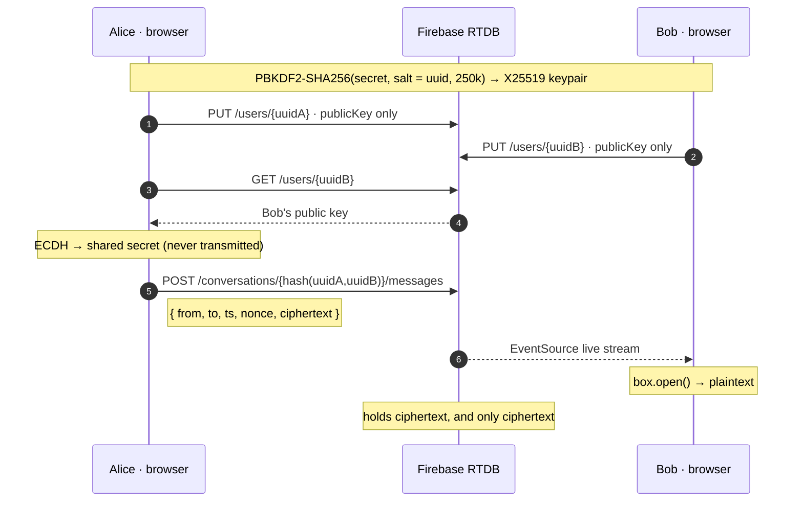

<div align="center">


# Umbra

**The datastore only ever sees ciphertext.**

Serverless, end-to-end encrypted chat. A static frontend, no backend, no SDK, no build step —
your keys are derived in the browser and never leave the device.

<br />


<br />

**[Live demo](https://kvsovanreach.github.io/demo-chat/)** ·
[How it works](#how-it-works) ·
[Security model](#security-model) ·
[Setup](#setup) ·
[Threat model](#what-is-and-isnt-protected)

<br />


</div>

---

## Why "Umbra"

The *umbra* is the innermost part of a shadow — the region where the light source is
blocked **completely**, not merely dimmed. That is the design goal here. The database is
not trusted-but-monitored; it is in total shadow. It holds `{from, to, ts, nonce, ciphertext}`
and cannot read a single message, because the key that would open them never reaches it.

---

## How it works

Identity is **derived, never stored**. Your UUID plus your passphrase produce an X25519
keypair through PBKDF2; the same pair reappears on any device from the same two inputs, and
nothing sensitive is ever persisted or transmitted.



Message **type and mime are sealed inside** the ciphertext as a JSON envelope, so the store
cannot even distinguish an image from a line of text.

---

## Security model

| Layer | Mechanism |
|---|---|
| Cipher | XSalsa20-Poly1305 — authenticated encryption |
| Key exchange | X25519 ECDH via TweetNaCl `box` |
| Key derivation | PBKDF2-SHA256, **250 000 iterations**, salted per-UUID |
| Conversation paths | `hash(sorted(uuidA, uuidB))` truncated to 40 hex — unguessable, unenumerable |
| Identity binding | Public keys are **write-once**, blocking key substitution |
| Verification | Signal-style 12-group safety number + TOFU key-change alert |
| Transport | HTTPS, required — WebCrypto refuses to run outside a secure context |

The per-UUID salt means an attacker must attack each identity separately: no rainbow tables,
and a weak passphrase costs 250 000× more to grind than a bare hash would.

---

## Setup

### 1 · Realtime Database

Firebase Console → **Build → Realtime Database → Create** → start in **locked mode**.
Copy the URL, e.g. `https://your-project-default-rtdb.firebaseio.com`.

### 2 · Anonymous Auth

**Build → Authentication → Sign-in method → Anonymous → Enable.**

### 3 · Database rules

**Realtime Database → Rules** → paste and **Publish**:

```json
{
  "rules": {
    ".read": false,
    ".write": false,
    "users": {
      "$uuid": {
        ".read": "auth != null",
        ".write": "auth != null && (!data.exists() || newData.child('publicKey').val() === data.child('publicKey').val())",
        ".validate": "newData.hasChildren(['publicKey','updated']) && newData.child('publicKey').isString() && newData.child('publicKey').val().length <= 64"
      }
    },
    "conversations": {
      "$cid": {
        ".read": "auth != null",
        "messages": {
          "$mid": {
            ".write": "auth != null && !data.exists()",
            ".validate": "newData.hasChildren(['from','to','ts','n','c']) && newData.child('n').isString() && newData.child('c').isString() && newData.child('c').val().length <= 400000"
          }
        },
        "typing": { "$uuid": { ".write": "auth != null", ".validate": "newData.isNumber()" } },
        "read":   { "$uuid": { ".write": "auth != null", ".validate": "newData.isNumber()" } }
      }
    }
  }
}
```

These enforce: **no enumeration** (the root is denied; you must already know an exact hashed
key), **write-once public keys** (no MITM key substitution), **append-only immutable
messages**, **shape and size validation**, and **auth on every request** — so disabling the
Anonymous provider is an instant kill switch.

### 4 · Point the app at your project

Edit [`js/config.js`](js/config.js):

```js
window.FIREBASE_CONFIG = {
  databaseURL: 'https://your-project-default-rtdb.firebaseio.com',
  apiKey: 'AIza…your web api key',   // Project settings → General → Web API Key
};
```

> **Both values are public by design.** They ship in the JS and anyone can read them from the
> network tab. A Firebase Web API key is an *identifier, not a credential* — it cannot read the
> database or bypass a rule. Security comes from the rules above plus the encryption, never
> from hiding these. Open the browser console for the long version.

What the key *does* allow is unlimited anonymous token minting, so:

- **Restrict it** — Cloud Console → Credentials → your browser key → *Websites* → add
  `https://<you>.github.io/*` and `http://localhost:8000/*`. Keep **Identity Toolkit API**
  allowed or sign-in breaks. A speed bump, not a wall: referrers are forgeable.
- **Stay on Spark**, or set a budget alert on Blaze.
- **Add [App Check](https://firebase.google.com/docs/app-check)** if this outgrows a demo — it
  is the only real answer to a forgeable referrer.

### 5 · Run locally

WebCrypto needs a secure context, so `file://` will not work:

```bash
python3 -m http.server 8000
# → http://localhost:8000
```

### 6 · Deploy

```bash
git push -u origin main
```

**Settings → Pages → Deploy from a branch → `main` / `root`.** HTTPS is automatic.

---

## Usage

1. Press **gen** for your UUID — **never type a guessable name like `alice`.** Conversation
   paths hash *both* UUIDs, so a guessable pair is the one thing between a stranger and your
   encrypted history. See [Why the UUID matters](#why-the-uuid-matters).
2. Add a long, unique **secret key** and your **peer's UUID** → **Establish secure channel**.
   Your key fingerprint renders live as you type.
3. Your peer opens the app once to publish their key. The first connect fails with
   *"peer hasn't joined"* — expected; it still published *your* key. Have them connect, then retry.
4. **Verify once.** Tap the peer's identicon and compare the safety number over a call or in
   person. This is what catches a substituted key.
5. Chat. Click any bubble to reveal its raw ciphertext.

> Same UUID + same secret = same identity anywhere. Nothing is recoverable if you lose
> either — **keep your UUID**, since a 36-character id is not something you will memorise.

---

## What is (and isn't) protected

<table>
<tr><td width="50%" valign="top">

**✅ Protected**

- **Message content** — infeasible without the key
- **Key substitution** — public keys are write-once, so an *established* identity's key can never be swapped
- **Enumeration** — blocked by rules and hashed paths
- **Tampering** — messages are immutable and Poly1305-authenticated
- **Sniffing** — HTTPS end to end
- **Your secret** — never stored, never transmitted

</td><td width="50%" valign="top">

**⚠️ Still exposed**

- **Metadata** — anyone who knows both UUIDs can compute the path and see timestamps and sizes
- **Identity squatting** — an *unclaimed* UUID can be taken; your peer would then encrypt to the squatter
- **No forward secrecy** — keys are static; a leaked secret exposes past messages
- **Spam** — any authed client that can compute a path may append; injected junk is permanent
- **Open sign-up** — auth proves nothing about *who* is asking

</td></tr>
</table>

### Why the UUID matters

Every residual risk above is gated on UUID guessability. A generated UUID carries **122 bits**
of entropy, and a conversation id hashes **both** — roughly 244 bits to compute a path, which
is not brute-forceable. Type `alice` and all of it collapses to a dictionary guess.

It is only as strong as the *weaker* of the two ids: if your peer uses `bob`, your conversation
is exposed no matter how good your own UUID is. Tell them to press **gen** too.

Good for private, low-stakes chat and for learning real E2E cryptography. **Not** a Signal
replacement — that adds forward secrecy, verified identities, and a trusted server.

---

## Project layout

```
index.html          login + chat UI, single document
css/style.css       crypto-terminal design system · fully responsive
js/config.js        Firebase URL + API key (public by design)
js/crypto.js        PBKDF2 derivation, nacl.box, hashed conv ids, safety numbers
js/auth.js          anonymous Firebase Auth over REST + token refresh
js/firebase.js      raw REST client + live EventSource stream, auto-reconnect
js/app.js           UI wiring, identicons, ciphertext peek, scramble reveal
lib/                vendored TweetNaCl + util — the only dependencies, both offline
assets/             icon set and screenshots
```

No package manager, no bundler, no transpiler. Clone it and open it.

---

<div align="center">
<sub>Built with TweetNaCl · deployed on GitHub Pages · the server still sees nothing</sub>
</div>
